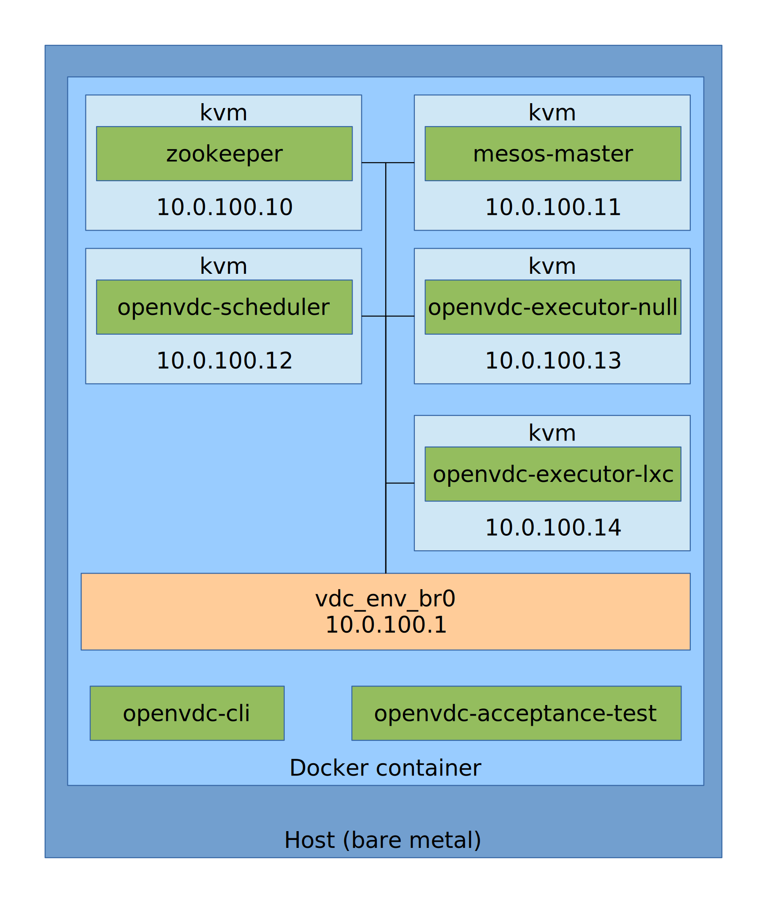

# OpenVDC Acceptance Test

## Quick start



This is the environment used on the OpenVDC CI to run the integration tests. To run this environment locally first make a file containing the following environment variables.

```
# The following two lines make up the yum repository from which we'll download OpenVDC packages to test
# "https://ci.openvdc.org/repos/${BRANCH}/${RELEASE_SUFFIX}/"
BRANCH="master"
RELEASE_SUFFIX="current"

# Set to "1" if you don't want to remove the docker container after running
REBUILD="0"
```

Let's save this file as `build.env`. Now kick off the `build_and_run_in_docker.sh` script, passing in that file as an argument.

```
./build_and_run_in_docker.sh build.env
```

That's it. This should build the environment and run the tests

## The nitty gritty

Here's everything you should know about how this acceptance test works exactly.

### The actual test code

The actual test code is in the `tests` directory. This is written in go using the [Testing](https://golang.org/pkg/testing/) package. These tests are compiled as a binary and packages in an rpm called `openvdc-acceptance-test`. This way we don't have to worry about installing go and setting up a GOPATH on the test environment.

### The docker container

The test environment consists of multiple KVM machines and we've decided to put them all together in a Docker container. That way we can test multiple branches in parallel and cleanup becomes simple. We just remove the container when we're done.

The command we run inside of the docker container is `run_tests.sh`. This script will first write the correct OpenVDC yum repository to `/etc/yum.repos.d/openvdc.repo`. The environment variables described in [Quick start](#Quick-start) decide which repository is used.

Next the `run_tests.sh` script installs the `openvdc-acceptance-test` package through yum which depends on `openvdc-cli`.

Now we build the KVM environment.

### The KVM environment

The code that builds the KVM machines running inside of the docker container is in the `multibox` directory.

If you want to run this KVM environment locally without docker, you can do so like this.

```
BRANCH=master RELEASE_SUFFIX=current REBUILD=false ./build.sh
```

This environment uses a caching system to avoid having to constantly rebuild the images every time we test a new branch or commit. The system works as follows.

#### First time ever run

* Download seed image containing a minimal Centos 7. All images built are based on this.

#### First time run on a branch

* Build images in .raw format **without** openvdc installed. We use .raw so we can loopback mount and install packages using chroot.

* Convert images to .qcow format so we can use copy on write.

* Store images in cache directory.

#### Every time we run on a branch

* Copy-on-write cached images for branch to the directory we will run KVM from.

* Run KVM.

* Install OpenVDC packages on KVM VMs for the branch/commit we're testing

### The actual tests

Once the KVM environment is in place we can run the actual tests. This is the `run_tests.sh` script's final action.

To make sure that the `openvdc` command doesn't require root previliges, we run it as an unpreviliged `axsh` user.
