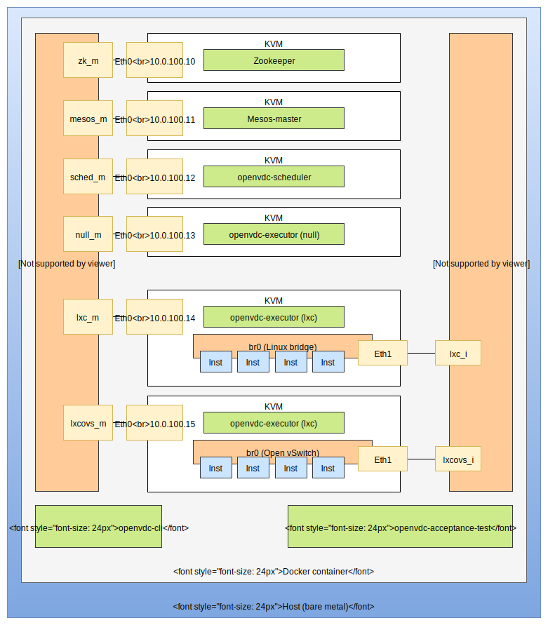

# OpenVDC Acceptance Test

This is the environment used on the OpenVDC CI to run the integration tests.



To run this environment locally first make a file containing the following environment variables.

```
# The following two lines make up the yum repository from which we'll download OpenVDC packages to test
# "https://ci.openvdc.org/repos/${BRANCH}/${RELEASE_SUFFIX}/"
BRANCH="master"
RELEASE_SUFFIX="current"

# Set to "1" if you want to remove the Docker container after running
REBUILD="0"

# This variable holds the directory on the *host* that will be bind mounted
# into the Docker container to place the cache for KVM images.
# If not provided, the default value is "/data2"
DATA_DIR=/data2
```

Let's save this file as `build.env`. Now kick off the `build_and_run_in_docker.sh` script, passing in that file as an argument.

```
./build_and_run_in_docker.sh build.env
```

That's it. This should build the environment and run the tests

## Running it locally without docker

The docker container is [very useful on the CI](#the-docker-container) but when running locally to write new tests, it just gets in the way. Here's how to run it without docker.

First make some directories to store the VM images.

```
mkdir -p $HOME/work/openvdc-multibox-data/openvdc-ci/boxes
mkdir -p $HOME/work/openvdc-multibox-data/openvdc-ci/branches
```

Now edit `ci/citest/acceptance-test/multibox/config.source` and tell it to use those directories.

```
#BOXES_DIR="/data/openvdc-ci/boxes"
#CACHE_DIR="/data/openvdc-ci/branches"

BOXES_DIR="$HOME/work/openvdc-multibox-data/openvdc-ci/boxes"
CACHE_DIR="$HOME/work/openvdc-multibox-data/openvdc-ci/branches"
```

Now build the environment.

```
cd ci/citest/acceptance-test/multibox/
BRANCH=master RELEASE_SUFFIX=current REBUILD=false ./build.sh
```

Setting `BRANCH` and `RELEASE_SUFFIX` this way will install the version of OpenVDC that's currently on the master branch.

You can replace them with any other version including your feature branch as long as it has RPMs up. If you don't have RPMs of your feature branch up, you copy your local compiled binaries to the environment after installing from master.

The tests will run the openvdc command so we need to make sure it's in our PATH. We can just compile it from the local source.

```
# In the openvdc root folder
go run ./build.go
mkdir bin
mv openvdc bin
PATH=$PWD/bin:$PATH
```

Set up `.openvdc/config.toml` with the correct configuration so the `openvdc` command will use the test environment.

```
mkdir ~/.openvdc
cp ci/citest/acceptance-test/dot_openvdc-config.toml ~/.openvdc/config.toml
```

Now you can run the tests

```
cd ci/citest/acceptance-test/tests
go test -v -tags=acceptance ./...
```


## The nitty gritty

Here's everything you need to know about how this acceptance test works exactly.

### The actual test code

The actual test code is in the `tests` directory. This is written in go using the [Testing](https://golang.org/pkg/testing/) package. During the CI's rpmbuild stage, these tests are compiled as a binary and packaged in an rpm called `openvdc-acceptance-test`. This way we don't have to worry about installing go and setting up a GOPATH on the test environment.

### The Docker container

The test environment consists of multiple KVM machines and we've decided to put them all together in a Docker container. That way we can test multiple branches in parallel and cleanup becomes simple. We just remove the container when we're done.

The command we run inside of the Docker container is `run_tests.sh`. This script will first write the correct OpenVDC yum repository to `/etc/yum.repos.d/openvdc.repo`. The environment variables described in [Quick start](#quick-start) decide which repository is used.

Next the `run_tests.sh` script installs the `openvdc-acceptance-test` package through yum which depends on `openvdc-cli`.

Now we build the KVM environment.

### The KVM environment

The code that builds the KVM machines running inside of the Docker container is in the `multibox` directory.

If you want to run this KVM environment locally without Docker, you can do so like this.

```
BRANCH=master RELEASE_SUFFIX=current REBUILD=false ./build.sh
```

This environment uses a caching system to avoid having to constantly rebuild the images every time we test a new branch or commit. The system works as follows.

#### First time ever run

* Download seed image containing a minimal Centos 7. All images built are based on this.

#### First time run on a branch

**If REBUILD != "true" (default)**

* Copy cache from the master branch and use them as cache for the branch we're testing.

**If REBUILD == "true" (to be used if the CI environment changed)**

* Build images in .raw format **without** openvdc installed. We use .raw so we can loopback mount and install packages using chroot.

* Convert images to .qcow format so we can use copy-on-write.

* Store images in the branch's cache directory.

#### Every time we run on a branch

* Copy-on-write cached images for branch to the directory we will run KVM from.

* Run KVM.

* Install OpenVDC packages on KVM VMs for the branch/commit we're testing

The cache directory is bind mounted into the Docker container so the same cache is re-used every time the tests run.

### The actual tests

Once the KVM environment is in place we can run the actual tests. This is the `run_tests.sh` script's final action.

To make sure that the `openvdc` command doesn't require root previliges, we run it as an unpreviliged `axsh` user.

### Cleanup

The `build_and_run_in_docker.sh` script traps EXIT and calls a cleanup function that will remove the Docker container unless `LEAVE_CONTAINER` is set.

The leftover KVM cache and Docker images are cleaned up periodically by a garbage collection job on Jenkins.

## FAQ

Keep in mind that all answers are true at time of writing (January 2017) and might no longer be accurate.

#### What OS has it run on successfully?

Fedora 23 and Arch Linux.

#### What Docker versions has it run on successfully?

1.10.3 on Fedora and 1.12.6 on Arch.

#### How much disk space is required?

609 MB for the KVM centos 7 seed image.

```
> du -hs openvdc-ci/boxes

609M    openvdc-ci/boxes
```

About 3.9 GB KVM cache per branch

```
> du -hs openvdc-ci/branches/*

3.9G    openvdc-ci/branches/acceptance-test
3.8G    openvdc-ci/branches/master
```

About 470 MB per Docker image plus about 190 MB for the base Centos 7 image.

```
> sudo docker images

REPOSITORY                TAG                       IMAGE ID            CREATED             SIZE
openvdc/acceptance-test   acceptance-test.current   8f53091d43bb        29 minutes ago      470.8 MB
centos                    7                         67591570dd29        5 weeks ago         191.8 MB
```

You do the math. :p

#### How much memory is required?

We've got 5 KVM machines with 1 GB of memory assigned to each one.
